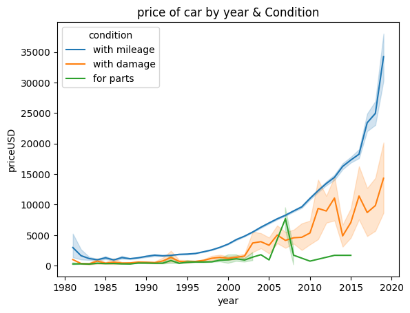
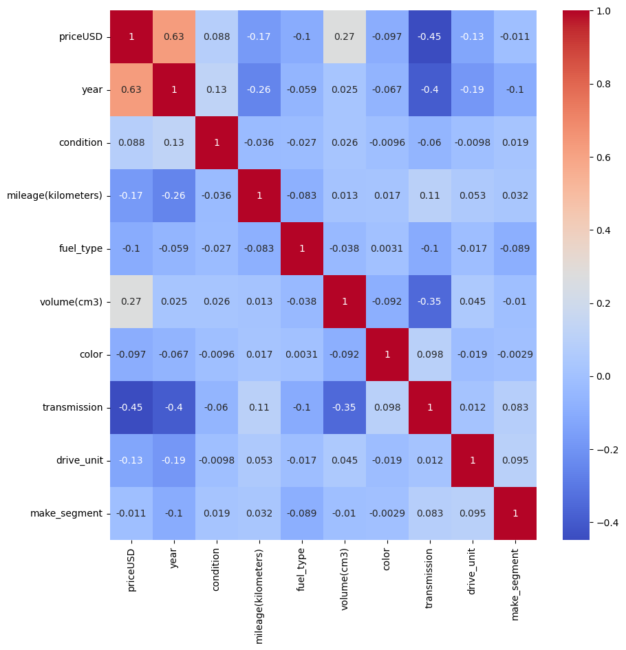
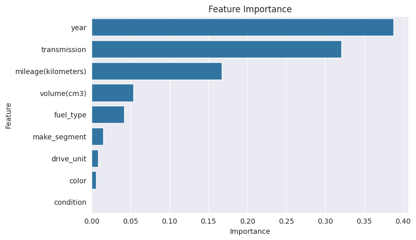

<p align="center">
  
</p>

# Car Price Prediction (Belarus)

I wanted to see how much of a used car's asking price in Belarus can be explained by things you'd see in a normal listing: the year, the mileage, the engine size, the gearbox and so on. So I took a Kaggle dataset of about 56k listings, cleaned it up, looked at the trends, and fit a decision tree regressor to predict the price in USD.

The short version: the model gets an R² of about 0.77 on the held-out test set, with an average error of roughly $1,870. Year and transmission type turned out to matter most.

The full write-up is in [REPORT.pdf](REPORT.pdf). The code is all in `final.ipynb`.

## Dataset

The data is a public Kaggle dataset of used car listings from Belarus (`cars.csv`). It has 56,244 rows and 12 columns:

| Column | What it is |
| --- | --- |
| make | Manufacturer |
| model | Model name (dropped, too many values) |
| priceUSD | Asking price in USD, the target |
| year | Year of production |
| condition | State at time of sale (with mileage, with damage, for parts) |
| mileage(kilometers) | Odometer reading |
| fuel_type | petrol, diesel or electric |
| volume(cm3) | Engine volume |
| color | Body colour |
| transmission | auto or mechanics (manual) |
| drive_unit | front, rear, all-wheel, part-time 4WD |
| segment | Body class (dropped) |

Dataset link: _add the Kaggle link here_

The CSV isn't in this repo. Download it yourself and drop it next to the notebook.

## A quick look at the data

<p align="center">
  
  
</p>

Left: price by year, split by condition. Right: correlation heatmap after encoding.

## What the notebook does

1. Loads the data and drops `model` and `segment`.
2. Groups the 96 different makes into 7 broader buckets (Luxury European, Mainstream European, Russian/Eastern European, Asian, American, Specialty, Other).
3. Explores the data with count plots, histograms and price-vs-year line plots split by condition, transmission, fuel type, drive unit and brand group.
4. Keeps only cars from 1981 onwards, drops rows with missing values, label-encodes the categorical columns.
5. Removes outliers with a z-score cutoff of 3.
6. Splits 80/20 into train and test.
7. Tunes a `DecisionTreeRegressor` with `GridSearchCV` (5-fold) and evaluates it.
8. Looks at feature importances.

## Results

| Metric | Test set |
| --- | --- |
| R² | 0.770 |
| MAE | $1,869 |
| RMSE | $2,712 |

Training R² was 0.788, so the model isn't badly overfitting. If anything it's a bit too simple.

<p align="center">
  
</p>

Feature importance, top to bottom: year (0.39), transmission (0.32), mileage (0.17), engine volume (0.05), fuel type (0.04). Everything else was under 0.02 and `condition` got zero.

<details>
<summary><b>Running it</b> (click to expand)</summary>

You need Python 3.9+ and these packages:

```
pip install pandas numpy matplotlib seaborn scikit-learn scipy jupyter
```

The notebook was written in Google Colab and reads the CSV from a mounted Google Drive:

```python
df = pd.read_csv('./drive/MyDrive/cars.csv')
```

If you're running it locally, delete the `drive.mount` cell and change that line to point at wherever you saved the file, e.g. `pd.read_csv('cars.csv')`.

One heads-up: the grid search includes `max_features="auto"`, which newer versions of scikit-learn no longer accept. You'll see a `FitFailedWarning` for those combinations (160 of the 480 fits failed for me). It doesn't break anything, the other combinations still run, but you can remove `"auto"` from the list if the warnings bother you.

</details>

## Things I'd fix or try next

- A few brands ended up in odd groups. Mazda is under "Luxury European" and Mercedes-Benz fell into "Other" because I missed it in my lists.
- The final tree uses `min_samples_leaf=4` and `random_state=0`, which weren't actually in the grid I searched. I set them by hand after looking at the results, so the tuning wasn't as clean as it should be.
- Label encoding treats colour and brand group like ordered numbers. One-hot encoding would be more honest for those.
- A random forest or gradient boosting model would probably beat a single tree by a good margin.
- Predicting log(price) instead of price would help with the long right tail.

## Files

```
.
├── assets/        # banner and plots used in this README
├── final.ipynb    # the whole analysis
├── REPORT.pdf     # longer write-up
└── README.md
```

## Author

[Your name]
